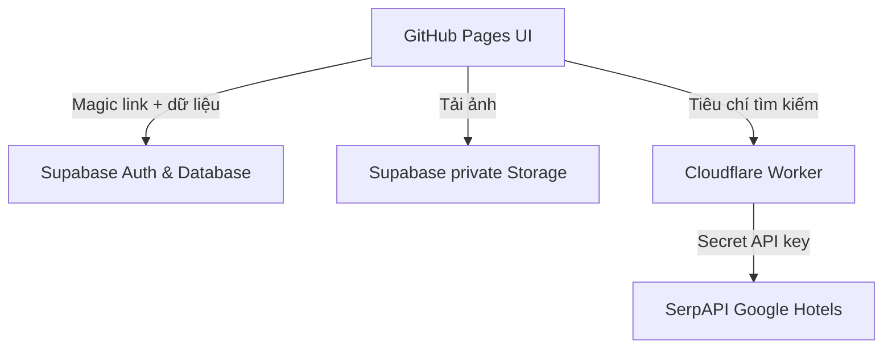

# Kiến trúc và bảo mật

## Quyết định chính

- **GitHub Pages** chỉ chứa frontend tĩnh, miễn phí và dễ cập nhật.
- **Supabase Auth + RLS** làm app riêng tư theo tài khoản. Frontend không thể tự bỏ qua policy database.
- **Supabase Storage private** giữ ảnh; tên file dùng UUID và policy kiểm tra user ID.
- **Cloudflare Worker** là lớp proxy mỏng để giữ SerpAPI key. Không gọi SerpAPI trực tiếp từ trình duyệt.
- **Trip document JSON** giúp MVP thay đổi cấu trúc lịch trình nhanh. Khi cần cộng tác nhiều người hoặc báo cáo phức tạp, có thể tách place/day/hotel thành bảng riêng.
- **Mỗi chuyến đi là một document độc lập** trong `trips` + `trip_documents`. Một tài khoản có thể tạo nhiều chuyến, đổi tên/ngày và chuyển qua lại mà timeline hoặc shortlist khách sạn không trộn lẫn.
- **Dữ liệu bản cũ được chuẩn hóa khi tải**: lịch “Đà Nẵng · Hội An” cũ trở thành một chuyến có thể chỉnh sửa; người dùng mới bắt đầu bằng “Chuyến đi 1” trống theo ngày hiện tại.
- Khi chọn khách sạn, frontend luôn yêu cầu chọn `tripId`, `dayId` và giờ nhận phòng trước khi ghi vào timeline.

## Ranh giới hiện tại

- Giá khách sạn là dữ liệu tham khảo theo thời điểm tìm, không phải cam kết đặt phòng.
- Ảnh do người dùng tải lên có URL ký thời hạn một năm; app có thể bổ sung cơ chế làm mới URL khi phát triển tiếp.
- Phiên bản hiện tại tối ưu cho một chủ sở hữu. Có thể mở rộng bảng `trip_members` để chia sẻ chuyến đi theo quyền xem/chỉnh sửa.
